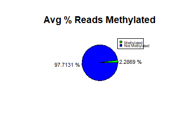

<!-- README.md is generated from README.Rmd. Please edit that file -->

# Description

<!-- badges: start -->

<!-- badges: end -->

The goal of ChIPAnalyzer is to provide the user with tools for the
analysis of ChIP-seq peaks representing protein binding sites on DNA.
ChIPAnalyzer provides methods for the analysis of G-quadruplexes
predicted by pqsfinder, as well as methods for analysis of ChIP-seq
peaks in relation to DNA methylation.

## Installation

The package can be installed from [GitHub](https://github.com/) with:

``` r
require("devtools")
devtools::install_github("RyDe4/ChIPAnalyzer", build_vignettes = TRUE)
library("ChIPAnalyzer")

#To run the shinyApp:
runChIPAnalyzer()
```

## Overview

``` r
ls("package:ChIPAnalyzer")
data(package = "ChIPAnalyzer)
```

ChIPAnalyzer is a package for the analysis of ChIP-seq data. It has
functions for the analysis G-quadruplexes abundance in the vicinity of
peaks using pqsfinder and functions for the analysis of DNA methylation
of ChIP-seq peaks. See vignettes for details:




``` r
browseVignettes("ChIPAnalyzer")
```

Package Structure:

``` 
-ChIPAnalyzer
  |- ChIPAnalyzer.Rproj
  |- DESCRIPTION
  |- LICENSE
  |- README
  |- inst
    |- extdata
      |- MAZ_high_score.bed
      |- HEK293MethylData.bed
  |- man
    |- findQuads.Rd
    |- getMethyOverlap.Rd
    |- getQuadCoveragePercentage.Rd
    |- plotMethylPercentage.Rd
    |- plotMultipleMethylPercentage.Rd
  |- R
    |- MethylSearch.R
    |- QuadCalc.R
    |- Visualization.R
  |- vignettes
    |- Analyze_G-quadruplexes.Rmd
    |- Analyze_Peak_Methylation.Rmd
  |- tests
    |- testthat
      |- MAZ_very_small_test.bed
      |- test-getMethylOverlap.R
      |- test-getQuadCoveragePercentage.R
      |- test-getQuadMatrix.R
      |- test-plotQuadPosition.R
    |- testthat.R
  
```

## Contributions

All functions in this package were written by the author, Ryan
Denniston. The function findQuads() relies on the pqsfinder package to
find potential quadruplex strings. For other dependencies, see
References. Various packages from the UCSC genome series are used to get
sequences in the getSurroundingSeq() helper function. GenomicRanges are
used throughout the package to manipulate data read in from BED files
Biostrings objects are also used to represent sequences. Methylation
example data was retreived from
<http://hgdownload.cse.ucsc.edu/goldenPath/hg19/encodeDCC/wgEncodeHaibMethylRrbs/>
and ChIP-SEQ example data was retreived from Series GSE104247 on GEO.
There is no publication associated with this accession.

## References

Lawrence M, Huber W, Pag\`es H, Aboyoun P, Carlson M, et al. (2013)
Software for Computing and Annotating Genomic Ranges. *PLoS Comput Biol*
9(8): e1003118. <doi:10.1371/journal.pcbi.1003118>

The Bioconductor Dev Team (2014). BSgenome.Hsapiens.UCSC.hg19: Full
genome sequences for Homo sapiens (UCSC version hg19). R package version
1.4.0.

The Bioconductor Dev Team (2014). BSgenome.Mmusculus.UCSC.mm10: Full
genome sequences for Mus musculus (UCSC version mm10). R package version
1.4.0.

The Bioconductor Dev Team (2014). BSgenome.Mmusculus.UCSC.mm9: Full
genome sequences for Mus musculus (UCSC version mm9). R package version
1.4.0

The Bioconductor Dev Team (2015). BSgenome.Hsapiens.UCSC.hg38: Full
genome sequences for Homo sapiens (UCSC version hg38). R package version
1.4.1.

Hon J, Martinek T, Zendulka J, Lexa M. (2017) pqsfinder: an exhaustive
and imperfection-tolerant search tool for potential quadruplex-forming
sequences in R. *Bioinformatics*. 33(21), 3373-3379.
<https://doi.org/10.1093/bioinformatics/btx413>

Tang, D. (2014, January 04). Using ENCODE methylation data. Retrieved
October 26, 2020, from
<https://davetang.org/muse/2013/05/09/using-encode-methylation-data/>

H. Pagès, P. Aboyoun, R. Gentleman and S. DebRoy (2019). Biostrings:
Efficient manipulation of biological strings. R package version 2.54.0.

Wickham, H. (2015). R Packages. O’Reilly & Associates.

UCSC Genome Browser Maintainers. (2011, September 22). Sequence and
Annotation Downloads. Retrieved November 13, 2020, from
<http://hgdownload.cse.ucsc.edu/goldenPath/hg19/encodeDCC/wgEncodeHaibMethylRrbs/>

Partridge, E. C., Chhetri, S. B., Mendenhall, E. M., & Myers, R. M.
(2019, November 27). GEO Accession viewer. Retrieved November 14, 2020,
from <https://www.ncbi.nlm.nih.gov/geo/query/acc.cgi?acc=GSE104247>

Winston Chang, Joe Cheng, JJ Allaire, Yihui Xie and Jonathan McPherson
(2020). shiny: Web Application Framework for R. R package version 1.5.0.
<https://CRAN.R-project.org/package=shiny>

Grolemund, G. (2015). Learn Shiny - Video Tutorials. 

## Acknowledgements

This package was developed as part of an assessment for 2020 BCB410H:
Applied Bioinformatics, University of Toronto, Toronto, CANADA
