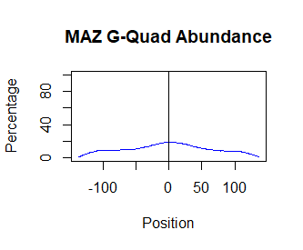

```{r, include = FALSE}
knitr::opts_chunk$set(
  collapse = TRUE,
  comment = "#>"
)
```

ChIPAnalyzer is an R package for investigating ChIP-seq peak calling data. ChIPAnalyzer has functions for analyzing G-quadruplex abundance in the vicinity of ChIP-seq peaks as well as functions for analyzing the DNA methylation of peaks.

```
library(ChIPAnalyzer)
ls("package:ChIPAnalyzer")
```
Executing the following set of commands will generate a plot of G-quadruplex abundance in the vicinity of ChIP-seq peaks.

```
system.file("extdata", "MAZ_high_score.bed", package = "ChIPAnalyzer")
reports <- findQuads(bedPath = "MAZ_high_score.bed",
seqWidth = 275,
   assemblyVersion = "hg19")
 qMatrix <- getQuadMatrix(quadReports = reports, maxOnly = TRUE)
 quadCoveragePercentage <- getQuadCoveragePercentage(quadMatrix = qMatrix)
plotQuadPosition(quadCoveragePercentage, "MAZ G-Quad Abundance")
```
The image below shows the plot generated by this code. The vertical line in the centre of the plot represents the centre of a peak and the numbers on the x axis to the left and right represent a position upstream or downstream from a peak. The percentage on the y-axis represents the percentage of peaks that have a G-quadruplex at the given position.



Executing the following code will plot a pie graph of the percentage of bases within peaks that are methylated.

```
system.file("extdata", "MAZ_high_score.bed", package = "ChIPAnalyzer")
system.file("extdata", "HcfUMethylData.bed", package = "ChIPAnalyzer")
overlap <- getMethylOverlap("MAZ_high_score.bed", "HcfUMethylData.bed")
plotMethylPercentage(overlap)
```
We can see below that about 97.7% of bases in the MAZ peaks are not methylated


ChIPAnalyzer also offers a Shiny GUI for ease of use.

```
#to run the ChIPAnalyzer Shiny App
runChIPAnalyzer()
```


